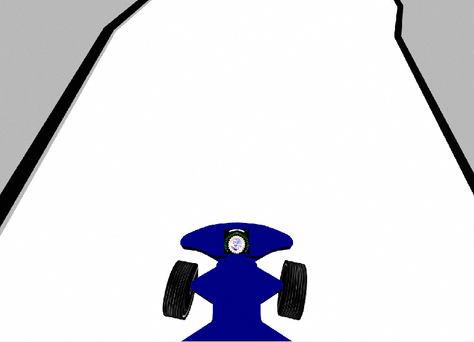
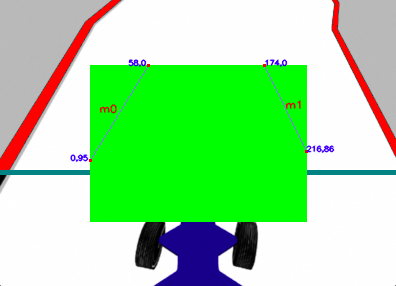

# Lane_Detection_CV
Objective of this to detect the black lines across lane for self driving mechanism.
  Starting from first:
# OPENCV
we used opencv to detect black lines by taking hsv of white and producing a canny image across further detecting contours and marking it with special colour
We finally used the image and its points to get vectors whic are m0_x0 m0_x1 m1_x0 m1_x1 m0_y1 m0_y1 m1_y1 m1_y1 by using simple calculations
<h3>Here are some output images</h3>
 Input Image

 Output Image

